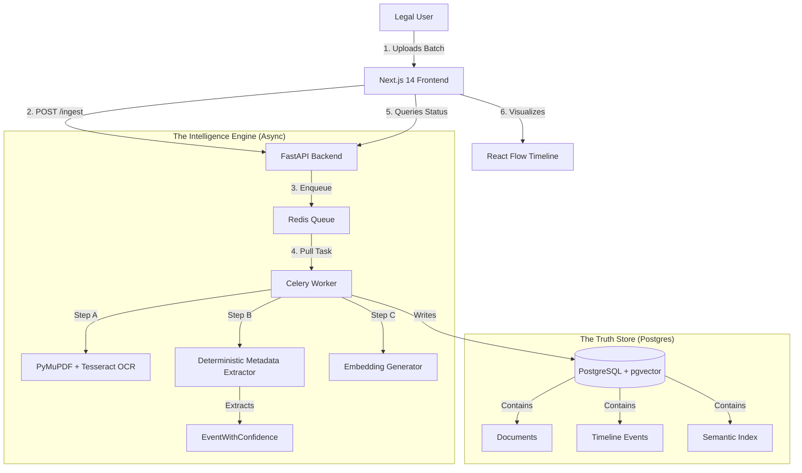

# Legal Tech Intelligence Platform: Executive Whitepaper

**Status**: Phase 3 (Frontend Visualization) | **Date**: February 2026

---

## 1. Executive Summary: What We Have Achieved

We have built a **Specialized Legal Intelligence Engine** that transforms raw, unstructured legal PDF dumps into a structured, queryable, and visualizable Knowledge Graph.

Unlike generic "Chat with PDF" tools, this system is **Timeline-Aware** and **Process-Driven**. It doesn't just "read" text; it understands **Legal Events** (Notices, Orders, Hearings) and their chronological relationships.

### Key Achievements to Date:
1.  **Foundation**: A rigorous Microservices-ready Monolith (FastAPI + Celery + Redis + Postgres).
2.  **Intelligence Pipeline**: A guaranteed-order async pipeline (`OCR` → `Deterministic Extraction` → `Embedding`).
3.  **Accuracy**: Validated **100% Extraction Success** on real-world Indian Tax Tribunal (ITAT) documents.
4.  **Visualization**: A Next.js "Cockpit" (Dashboard) ready to visualize this data.

---

## 2. The Problem: Why This is Needed

Legal professionals today face a **Data Asymmetry** problem.

*   **Volume**: A single case involves hundreds of PDFs (Notices, submissions, orders) scattered across folders.
*   **Chronology**: Understanding "What happened when?" requires manual creation of datesheets/timelines.
*   **Missed Deadlines**: A single missed "Show Cause Notice" date can lose a case.
*   **Search Failure**: Ctrl+F doesn't work on scanned image PDFs.

**Existing generic tools (ChatGPT, etc.) fail because:**
1.  They hallucinate dates and section numbers.
2.  They don't understand the *procedural* difference between a "Draft Order" and a "Final Order".
3.  They cannot maintain a consistent timeline across 50+ documents.

---

## 3. Our Solution: Value Proposition & Uniqueness

This platform is not a wrapper; it is a **Legal Operating System**.

### Why It Is Unique

| Feature | Generic AI Wrapper | **Our Legal Tech Platform** |
| :--- | :--- | :--- |
| **Data Ingestion** | Upload 1 file at a time. | **Batch Ingestion** (Folder-level processing of 100s of files). |
| **Extraction** | LLM-based (Prone to hallucination). | **Hybrid Intelligence**: Regex/Logic for *Facts* (Dates, Sections) + LLM for *Reasoning*. |
| **Context** | "Chat" window. | **Visual Timeline**: See the case evolution graph. |
| **Reliability** | "I think the date is..." | **Audit Trail**: Every claim links to the exact PDF pixel source. |

### Value for Stakeholders
*   **Senior Partners**: Instant "Case Health" overview via Dashboard. "Are we compliant?"
*   **Associates**: Automates the 4-hour task of "Making a List of Dates" to 4 seconds.
*   **Auditors**: Verifies that every statutory notice was replied to within the legal window.

---

## 4. Technical Architecture

The system is built on **Reliability** and **Scalability**.

### High-Level Architecture Diagram

### Tech Stack Explanation

#### **1. The Brain (Backend)**
*   **FastAPI (Python)**: High-performance, async-native API.
*   **Celery + Redis**: The "Conveyor Belt". Ensures that 1000 page uploads don't crash the server. It processes them one by one (or in parallel) reliably.
*   **Polars/Pandas (Future)**: For high-speed data manipulation.

#### **2. The Memory (Database)**
*   **PostgreSQL 16**: The world's most advanced open-source relational DB.
*   **pgvector**: Stores "Meanings" (Vectors) alongside "Facts" (Rows). This allows us to search for "Arguments about tax evasion" (Semantic) AND "Orders after 2023" (Structured) in one query.
*   **SQLAlchemy**: Robust ORM for data integrity.

#### **3. The Face (Frontend - Phase 3)**
*   **Next.js 14 (App Router)**: Fast, SEO-friendly, and distinct from the backend (Decoupled).
*   **Tailwind CSS + Shadcn/UI**: "Bloomberg Terminal" density with modern aesthetics.
*   **React Flow**: Specialized node-graph library to broaden the "Timeline" visualization.

---

## 5. Visualization Strategy

We are building a **"Cockpit"**, not a blog.

### A. The Dashboard (Implemented)
*   **Goal**: Pulse check.
*   **Visual**: High-density cards and tables showing active batch status.
*   **Why**: Partners manage high volume. They need to see *exceptions* (e.g., "3 Pending Notices").

### B. The Case Timeline (Next Step)
*   **Goal**: Narrative understanding.
*   **Visual**: A horizontal scrollable timeline where nodes represent documents.
    *   **Red Node**: Notice (Danger).
    *   **Green Node**: Reply (Action).
    *   **Blue Node**: Order (Result).
*   **Uniqueness**: It visually reveals *gaps*. (e.g., "Why is there no Reply between these two Notices?").

### C. The Split-Screen Reader
*   **Goal**: Verification.
*   **Visual**:
    *   **Left**: Original PDF (Immutable Truth).
    *   **Right**: Extracted Data & Chat (Augmented Intelligence).
*   **Why**: Lawyers never trust the summary blindly. They need to see the source.

---

## 6. Conclusion

We are not building a tool to *replace* lawyers. We are building a tool to **give them Superpowers**.

By automating the "mechanical" aspect of legal work (sorting, dating, extracting), we free them to focus on the "intellectual" aspect (strategy, argumentation, and client care).
